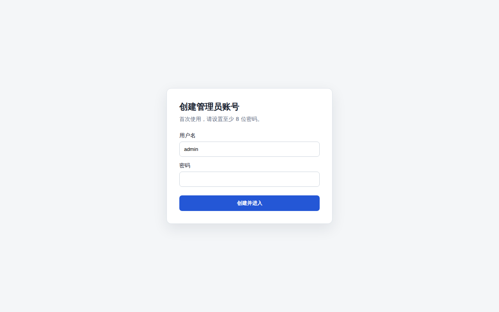

# dsh-web-auth-gateway

A standalone authentication reverse-proxy gateway plugin for DeepSeek Harness Web.

The plugin serves a login page on a separate loopback port. After authentication, it proxies the complete DSH Web surface, including normal pages, plugin assets, API requests, and WebSocket upgrades.

## Features

- First-run administrator account creation
- scrypt salted password hashing; plaintext passwords are never stored
- HttpOnly and SameSite=Strict session cookie
- Server-side in-memory sessions
- HTTP, API, and WebSocket authentication gate
- Settings card under `Settings > Plugins > Web UI Plugins`
- Configurable gateway port and session lifetime
- Official `@deepseek-ai/*` NPM SDK only
- No changes to DeepSeek Harness source code

## Install

Requires Node.js 22 or newer and DeepSeek Harness.

```sh
dsh plugin --profile web add github:luodeb/dsh-web-auth-gateway
```

Restart DSH Web:

```sh
dsh web --host 127.0.0.1 --port 3080
```

Then open:

```text
http://127.0.0.1:3090
```

On first access, create the administrator account. Later visits require that account.

## Settings

Open `Settings > Plugins > Web UI Plugins > Login gateway`.


Defaults:

```yaml
enabled: true
port: 3090
sessionTtlHours: 12
```

Settings are persisted through the official DSH Settings service in `~/.dsh/settings.yaml`.

## Login page



The password credential is stored at:

```text
~/.dsh/web-auth-gateway/credential.json
```

The file contains only the username, random salt, and scrypt password hash. Its mode is `0600`.

## Security boundary

The original DSH Web port must remain bound to `127.0.0.1` or another trusted interface. If the upstream port is exposed to untrusted clients, they can bypass the gateway.

This plugin currently listens on `127.0.0.1`. Use a TLS reverse proxy or a secure tunnel in front of the gateway for remote access. Do not expose plaintext HTTP directly to an untrusted network.

Sessions are stored in memory and are invalidated when DSH restarts.

## Development

```sh
corepack enable
pnpm install
pnpm build
pnpm typecheck
pnpm test
```

Install the local checkout into the Web profile:

```sh
dsh plugin --profile web add link:$(pwd)
```

## License

BSD-3-Clause
